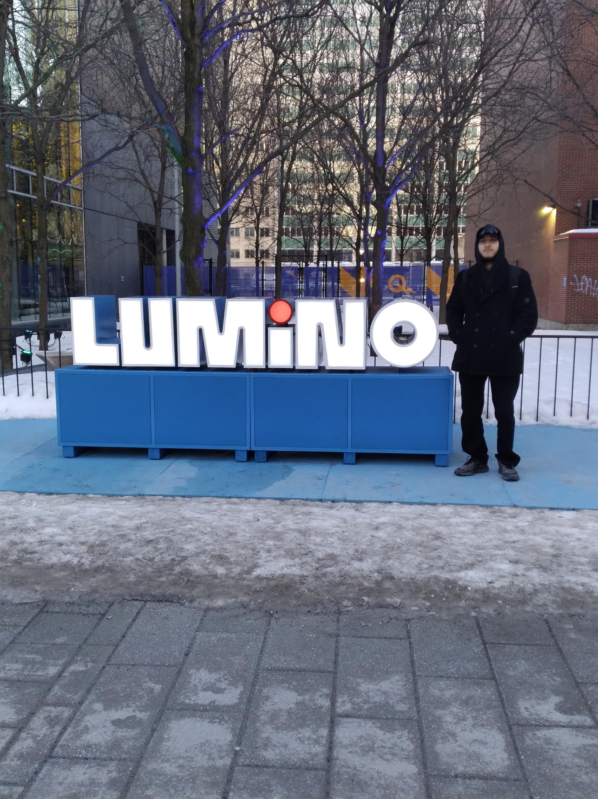
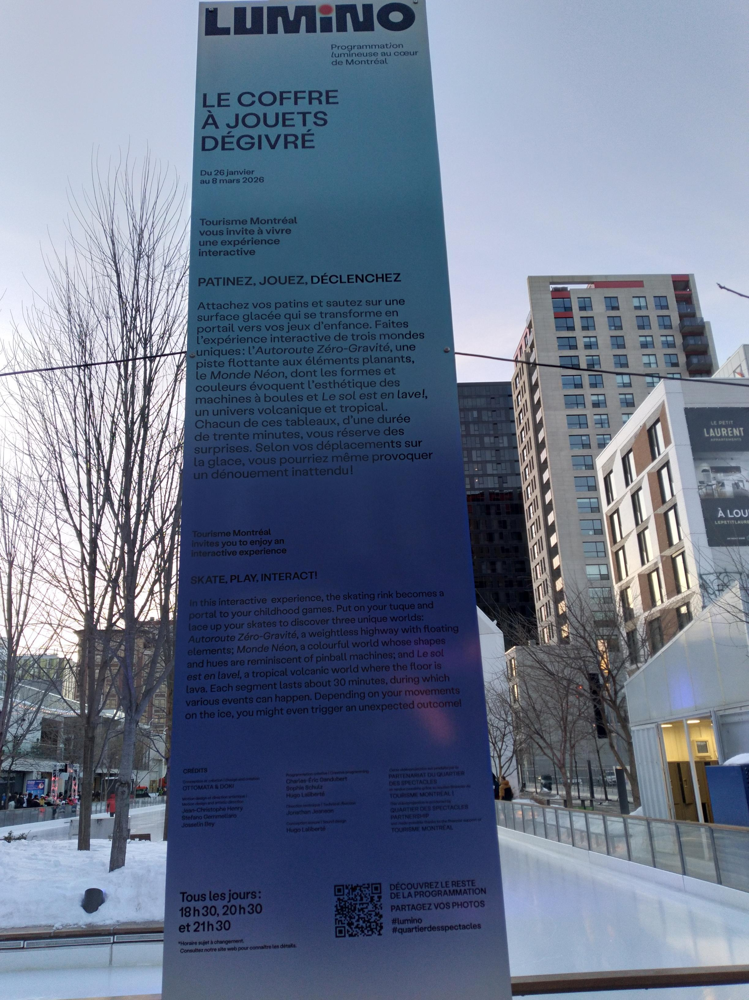
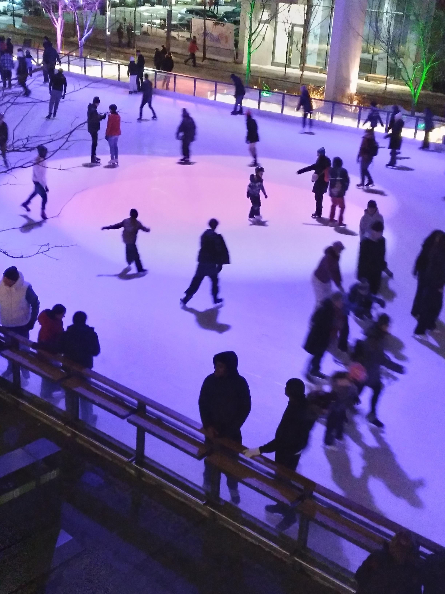
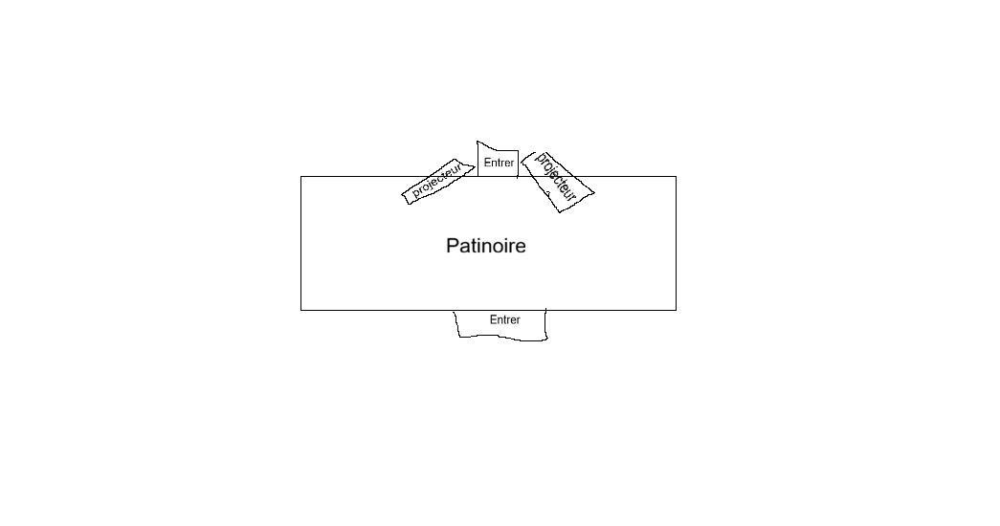
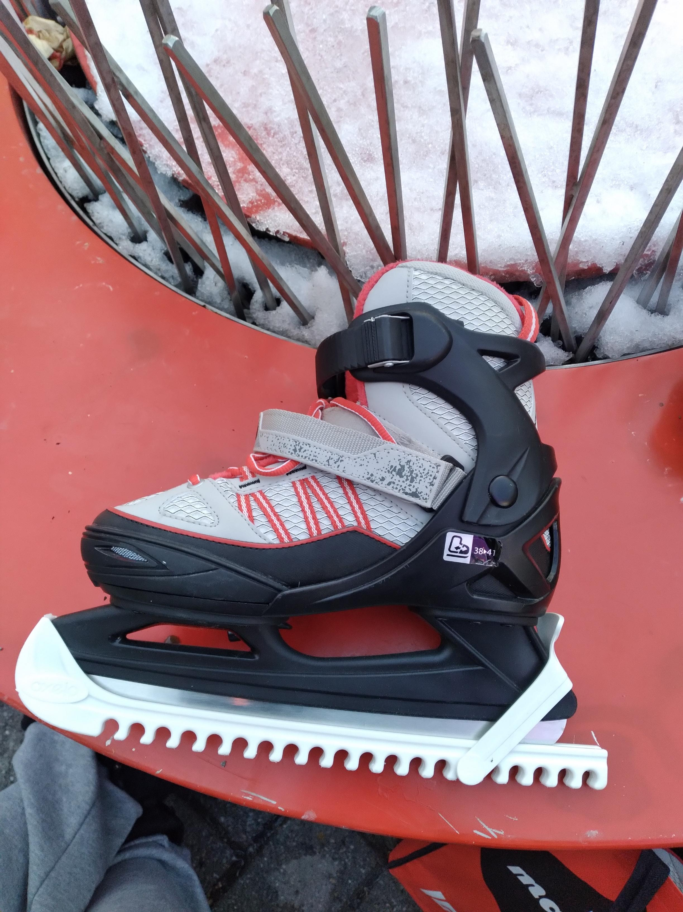
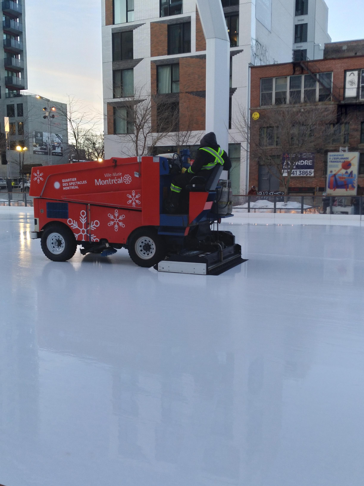
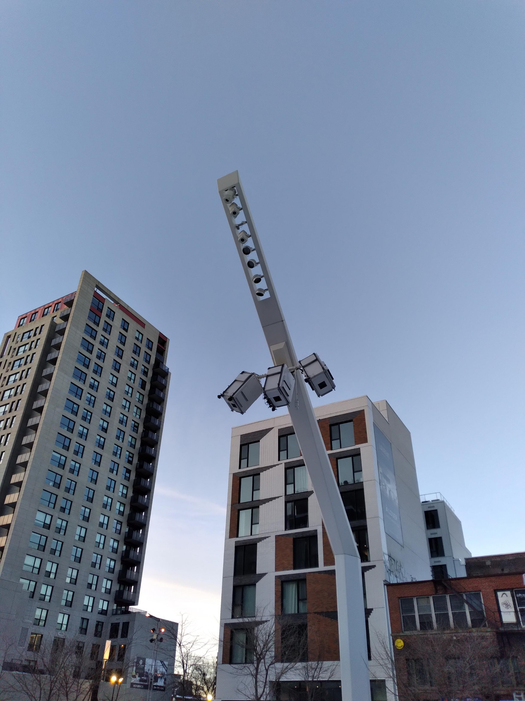
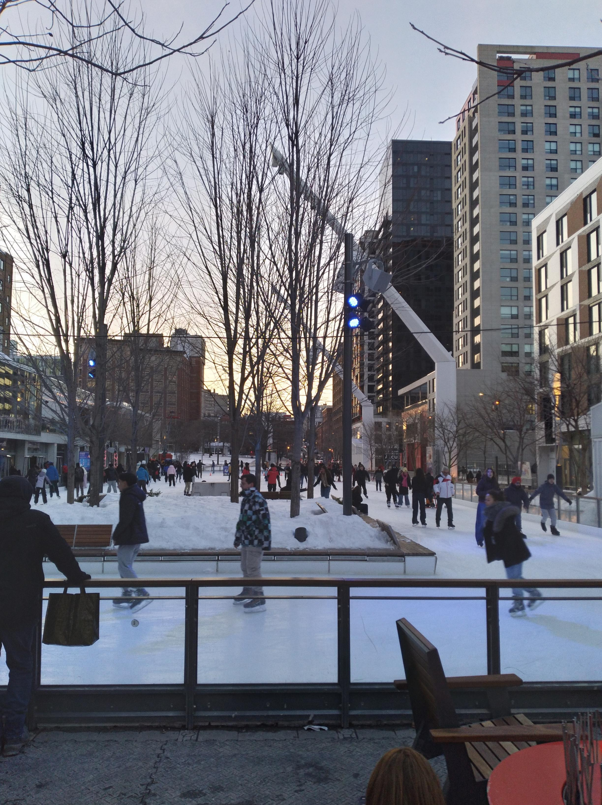
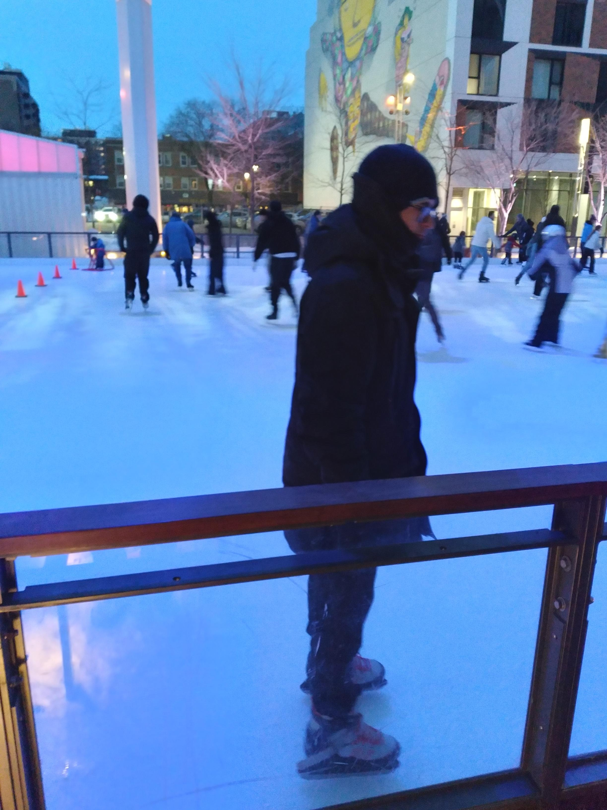

# Le coffre à jouets dégivré

## Place des arts, Montréal

>Moi qui se tiens devant l'entrée de l'exposition. Prise par ZC.

## Type d'exposition

L'oeuvre est temporaire.

## Date de visite

J'ai visité l'exposition lors du 28 février 2026.

## Titre de l'exposition

Le nom de l'oeuvre est le coffre à jouets dégivré.

## Nom de l'artiste

Les noms des artistes sont Ottomata & Doki

## Année de réalisation

L'exposition a fait ses débuts lors du 21 février 2022. 

## Description de l'oeuvre

L'oeuvre est une patinoire qui utilise des projections lors de la nuit, ainsi proposant des activités intéressantes, différentes scènes de projection telles que le sol est de la lave ou tu ne dois pas toucher les obstacles comme le jeu. Ensuite l’Autoroute Zéro-Gravité où tu suis le sens d'une route projetée et le Monde Néon où toutes les lumières sont des couleurs néons.

## Type d'installation

Cette installation est immersive.

## Mise en espace

## Composante et technique

Les composantes sont des projecteurs, une surfaceuse et une station de réfrégération en dessous de la patinoire.

## Éléments nécessaires à la mise en expo

Les éléments nécessaires à l'exposition sont une paire de patins, une combinaison chaude, une surfaceuse, de la glace ainsi que des projecteurs

## Expérience vécue

J'ai trouvé cette exposition absolument amusante ainsi que relaxante.

## Ce qui m'a plu

ce qui m'a plu était de voir le monde s'amuser et profiter de l'hiver pour patiner.

## Aspect a ne pas retenir

l'aspect que je ne voudrais pas retenir serait de faire l'exposition en extérieur.

## Référence
APRES

