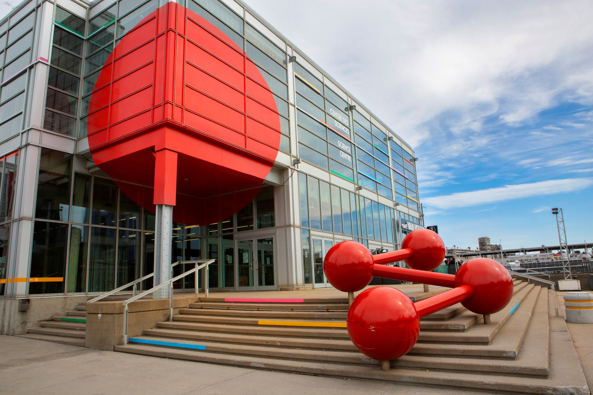
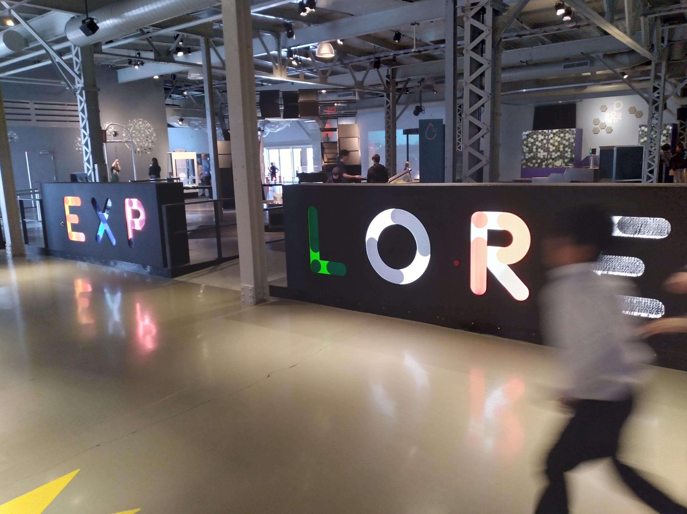
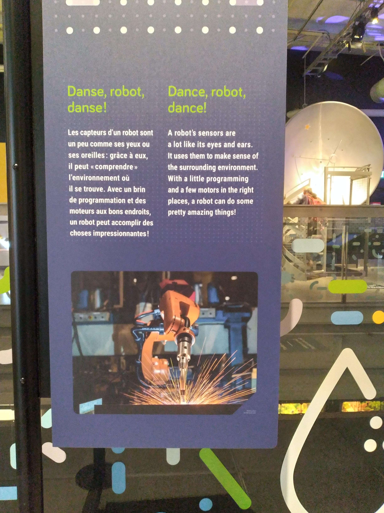
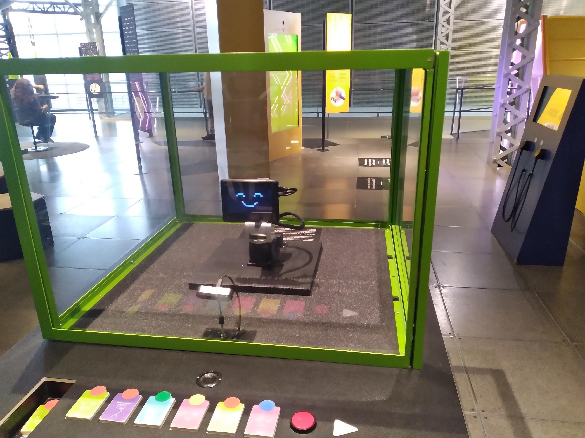
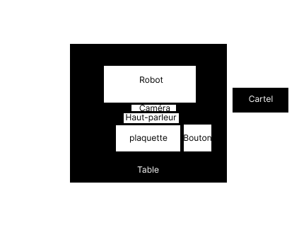
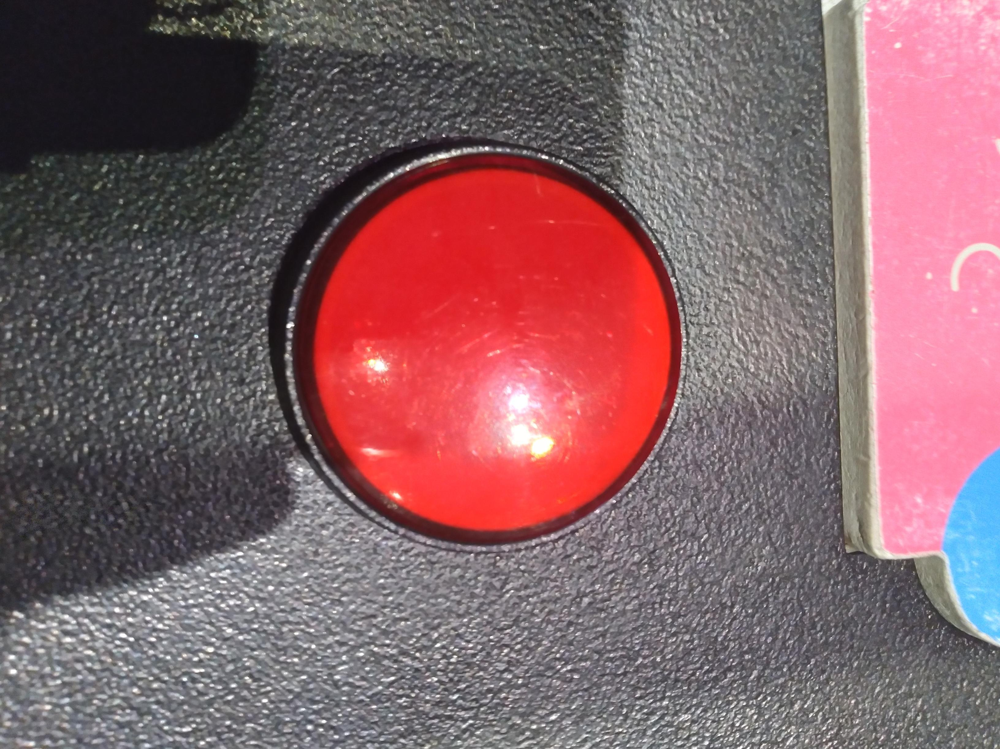
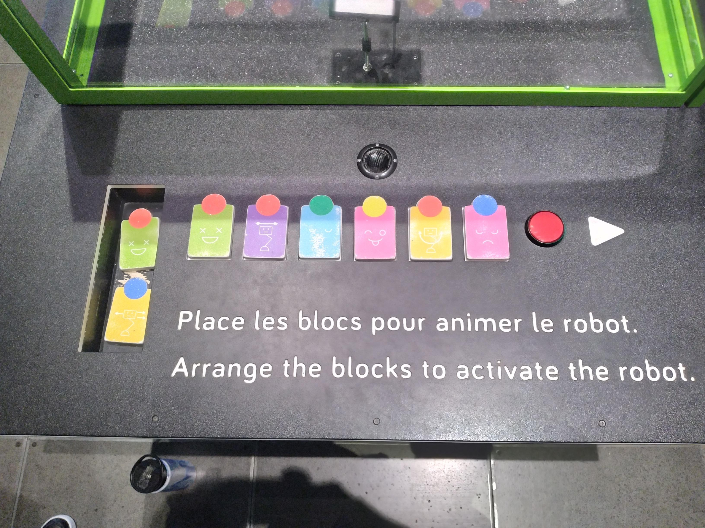
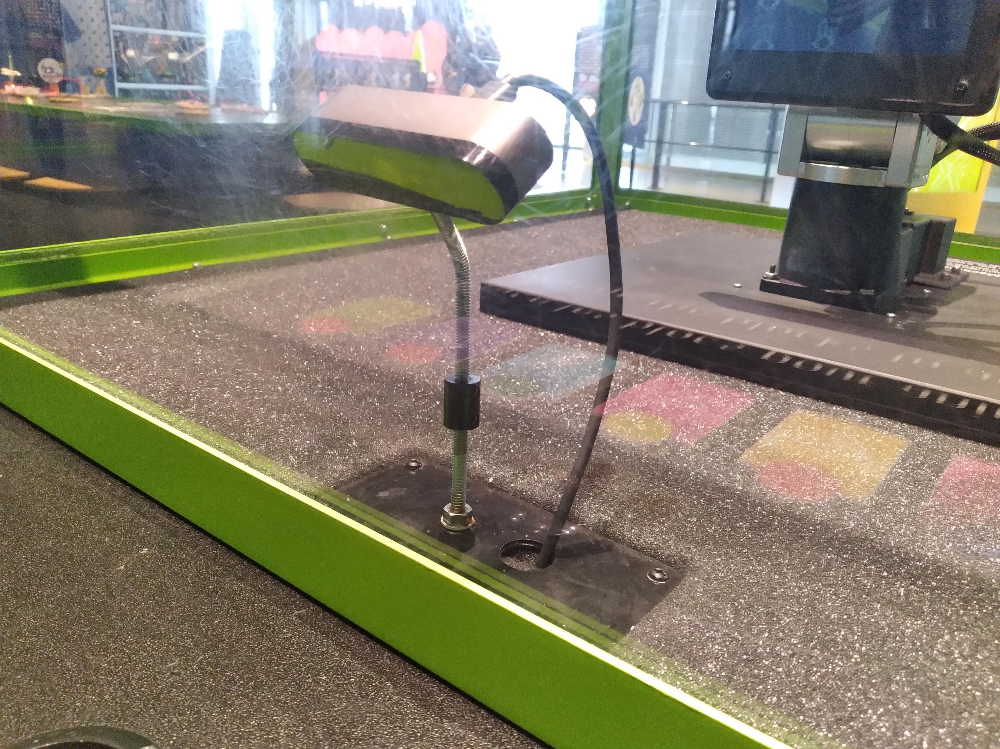
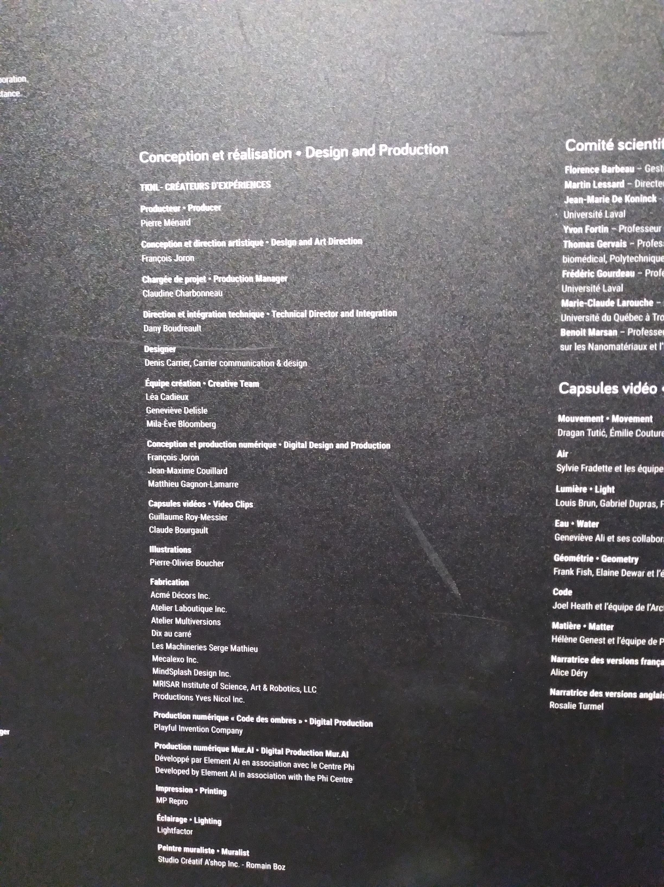
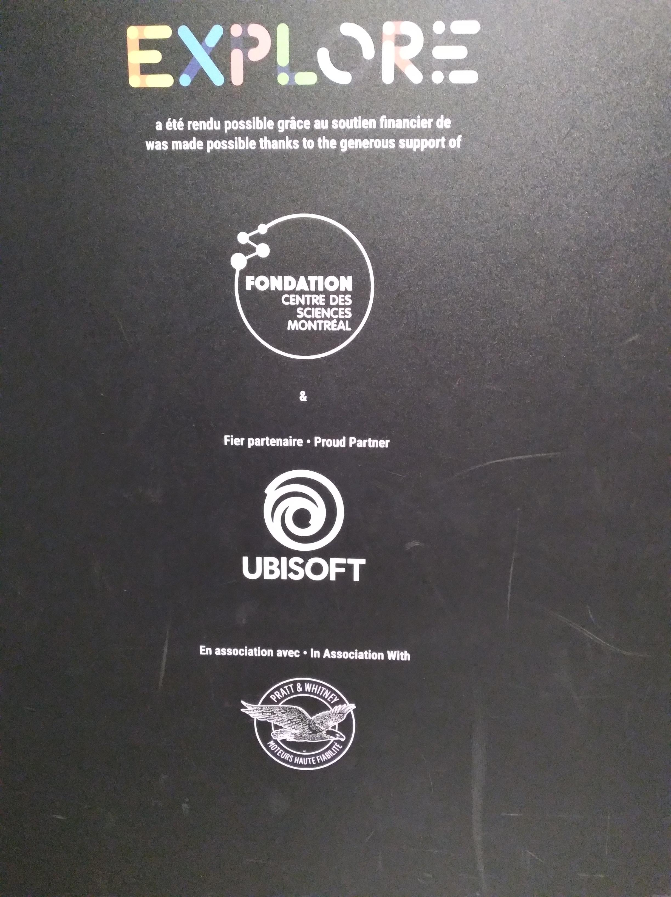

## Danse!, robot!, danse!

# Centre des sciences à Montréal

>Photo prise du site web

## Type d'exposition

L'oeuvre est permanente et accessible presque tous les jours.

## Date de visite

>Photo prise par ZC.

J'ai exploré le centre des sciences le premier avril 2026.

## Titre de l'exposition

>Photo prise par ZC.

Le nom de l'oeuvre est Meca500

## Nom de l'artiste

les artistes qui ont travaillé sur le dispositif sont illian Bonev et Jonathan Coulombe.

## Année de réalisation

L'exposition a été créée le 21 juillet 2021.

## Description de l'oeuvre

>Photo prise par ZC.

Le dispositif que j'ai choisi de présenter est un petit robot dans lequel tu dois placer des plaques de bois avec des émotions et des actions que le robot pourra effectuer lorsqu'elles sont placées sur les socles qui seront détectées par une caméra
Le robot va alors copier les sélections que tu as faites et les faire devant toi en jouant une petite musique.

## Type d'installation

Cette installation est interactive.

## Mise en espace

## Composante et technique

>Photo prise par ZC.

Les composantes de cette oeuvre sont un bouton, des plaques de bois, une table, une caméra, une sortie audio et le robot sont tous importants à la création de ce dispositif

## Éléments nécessaires à la mise en expo

Les éléments nécessaires à l'exposition sont les plaques en bois, le robot, le bouton et la caméra.

## Expérience vécue

J'ai trouvé cette exposition absolument divertissante.

## Ce qui m'a plu

Ce qui m'a plu était de voir le robot copier les mouvements que j'ai choisis sur les plaques.

## Aspect a ne pas retenir

L'aspect que je ne voudrais pas retenir serait que le robot parfois faisait les mauvais mouvements.

## Référence

Toutes images prise durant cette visite font partie de l'oeuvre de illian Bonev et Jonathan Coulombe et ont été prise par Zakk Cholette.

**[lien_artiste_site_web](https://www.centredessciencesdemontreal.com/blogue/danse-robot-danse?_gl=1*1q7rz6g*_gcl_au*NTU0ODc2NzAyLjE3Nzc1MTAyNDM.*_ga*Mzk0NzQyOTg0LjE3Nzc1MTAyNDM.*_ga_H22CRNZ3Q1*czE3Nzc1MTAyNDMkbzEkZzEkdDE3Nzc1MTAyODMkajIwJGwwJGgw)**

Grand remerciement à ces personnes pour avoir créé ce magnifique dispositif !

>Photo prise par ZC.

