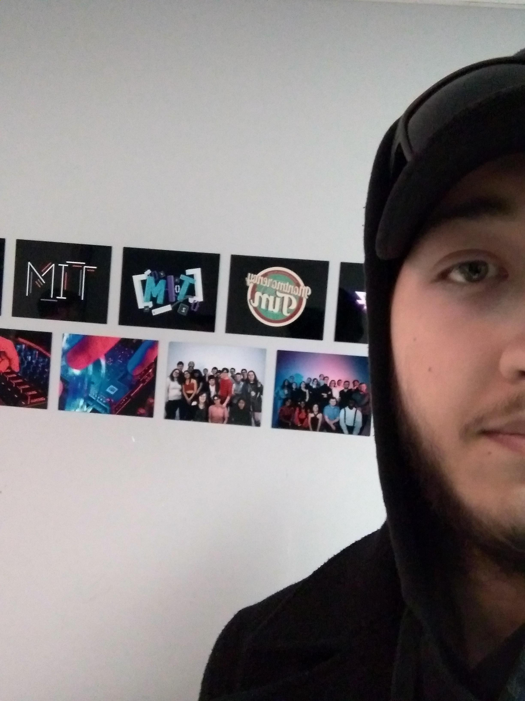
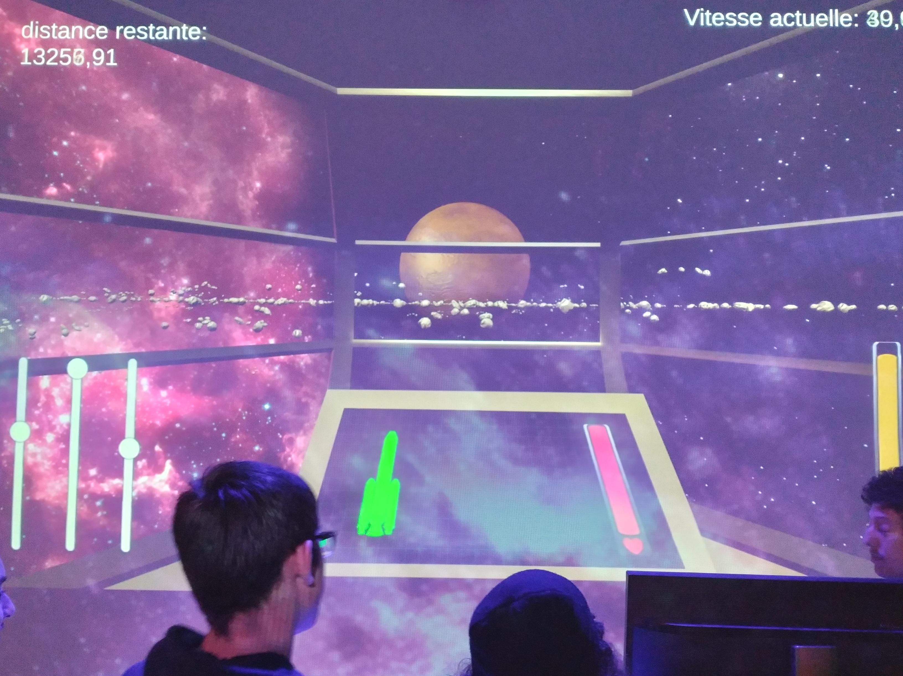
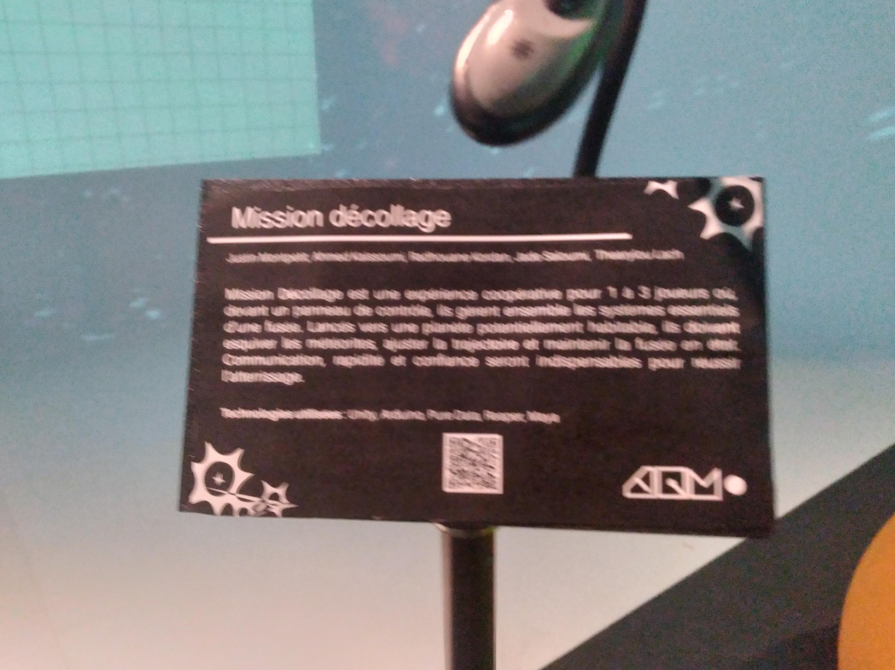
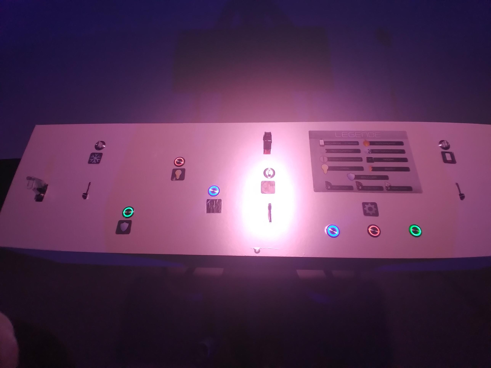
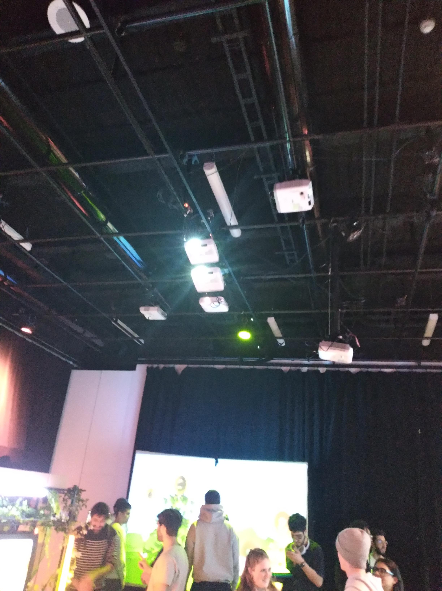
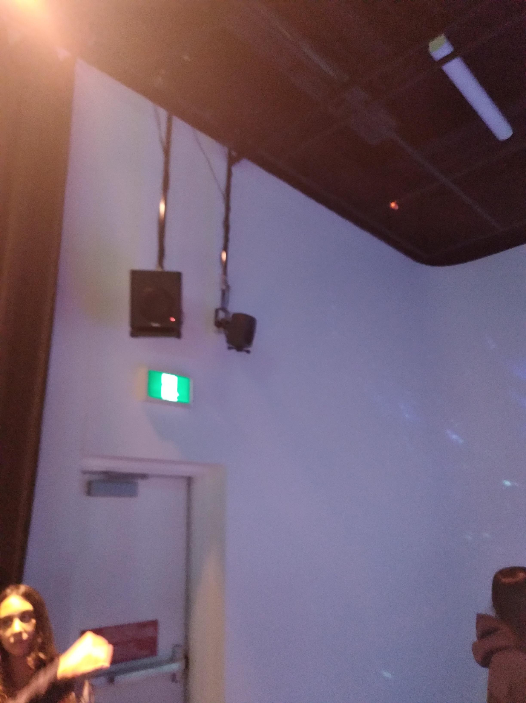
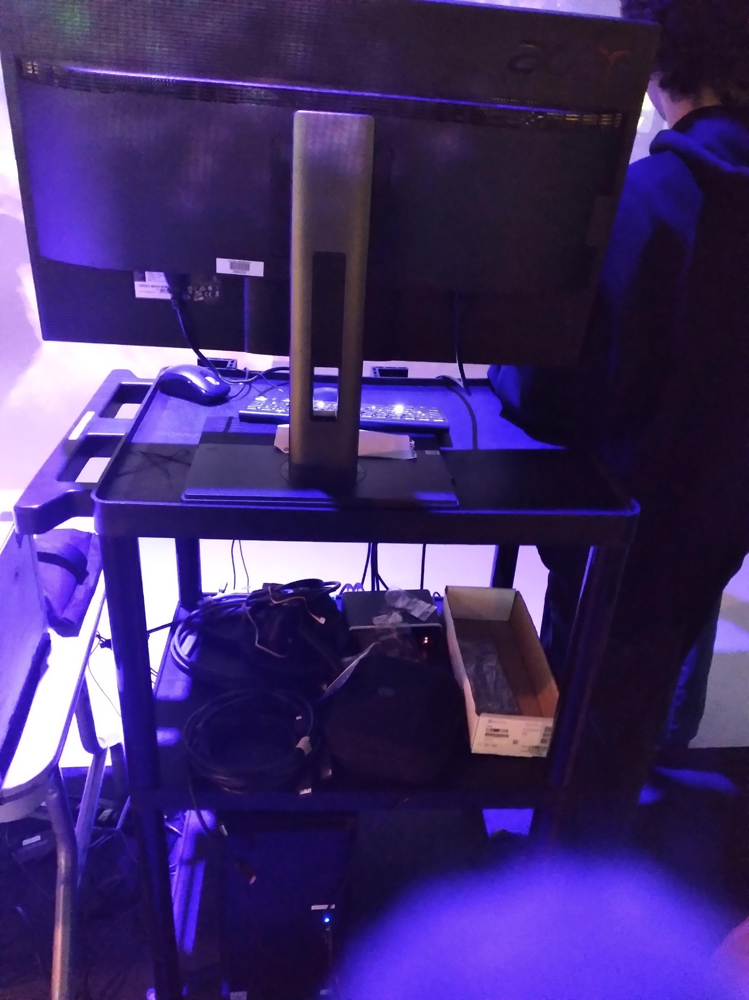
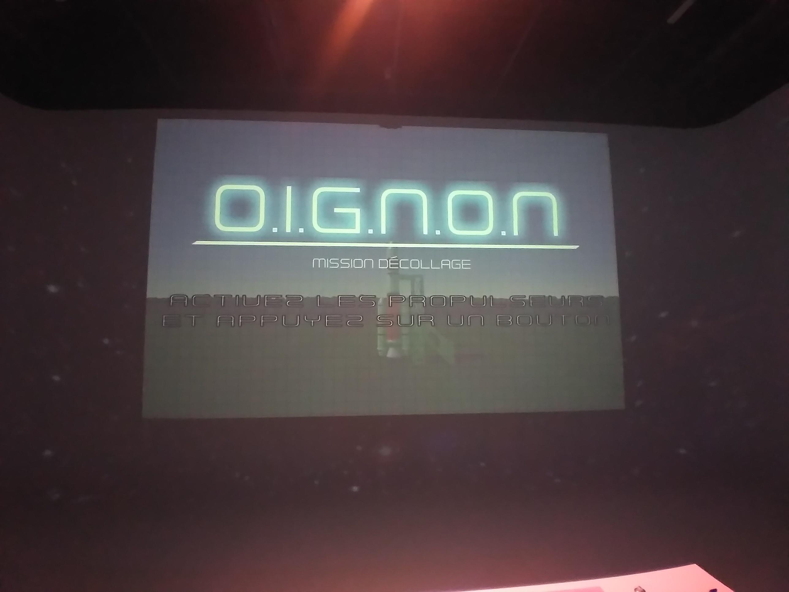

# Mission décollage

## Grand studio au collège Montmorency

>Moi qui se tiens devant l'entrée de l'exposition. Prise par ZC.

## Type d'exposition

L'oeuvre est temporaire.

## Date de visite

J'ai visité l'exposition lors du 24 février 2026.

## Titre de l'exposition

Le nom de l'oeuvre est mission décollage.

## Nom de l'artiste

Les noms des artistes sont Ahmed Kaissoumi, Radhouane Kordan, Justin Montpetit, Thearylou Lach et Jad Saloumi.

## Année de réalisation

L'exposition a fait ses débuts lors de l'année 2025-2026

## Description de l'oeuvre

>Photo prise par ZC.

L'oeuvre est un jeu interactif dans lequel on pilote un vaisseau seul ou avec un ou deux amis et on doit se rendre sur une planète et la rendre habitable, mais durant le chemin se trouvent des débris de météorite que vous devez esquiver et des dommages à réparer afin d'éviter la destruction du vaisseau, et pour cela tu dois avoir des coordinations parfaites avec ton équipe a bord.

## Type d'installation

Cette installation est interactive.

## Mise en espace

## Composante et technique

>Photo prise par ZC.

Les composantes sont un ordinateur, trois projecteurs, deux haut-parleurs, une carte de son, quatre câbles XLR, deux contrôleurs Arduino, trois contrôleurs Arduino mini, six boutons pressoir et trois toiles switch.

## Éléments nécessaires à la mise en expo

Les éléments nécessaires à l'exposition sont des projecteurs, haut-parleur, des boutons et interrupteurs et un ordinateur

## Expérience vécue

>Photo prise par ZC.

Je me sentais comme si j'étais dans la fusée avec mon équipe et nous devions réparer les dommages de la capsule et nous devions nous parler afin de se diriger.

## Ce qui m'a plu

Ce qui m'a plu était de jouer en coopération avec d'autres personnes et de communiquer pour se déplacer.

## Aspect a ne pas retenir

L'aspect que je ne voudrais pas retenir serait les commandes.

## Référence

Toutes images prise durant cette visite font partie de l'oeuvre de Ahmed Kaissoumi, Radhouane Kordan, Thearylou Lach, Justin Montpetit et Jad Saloumi et ont été prise par Zakk Cholette.

**[lien_artiste_site_web](https://o-i-g-n-o-n.github.io/Mission-decollage/#/)**

Dans ce site, vous trouverez des informations plus en détail.

