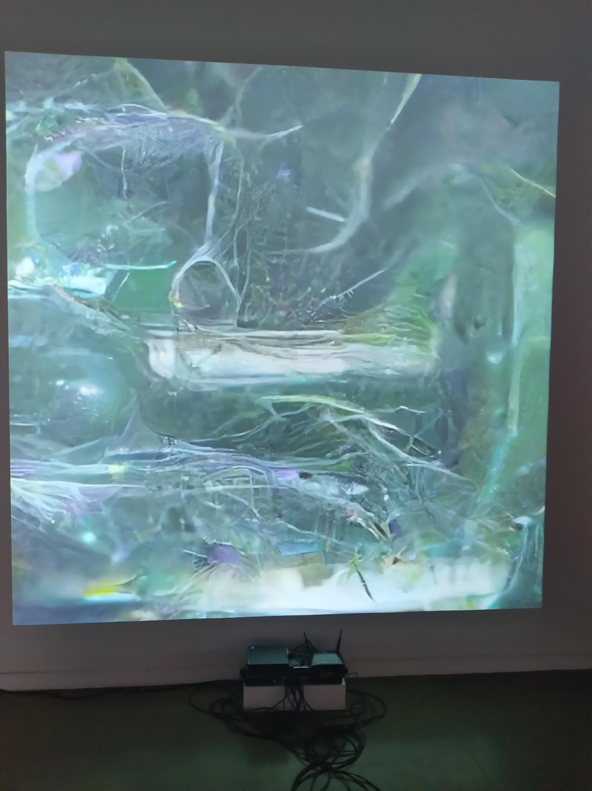

# Exposition Devenir

## Galerie de l'univerité de Montréal

Moi devant l'entrée de La galerie.

L'exposition est temporaire.

## Date de visite

La date de ma visite étais le 30 Janvier 2026.

## Titre de l'oeuvre

L'oeuvre ce nomme Techno Compost.

## Nom de l'artiste

Marie-Eve Levasseur.

## Année de réalisation

L'oeuvre a été réalisée en 2025.

## Type d'installation

L'installation est immersive.

## Composantes et techniques

les composantes de l'oeuvre est une chaise ainsi qu'un casque vr

## Description de l'oeuvre

Lorsque tu enfile le casque, tu te trouve dans une pièce ou des images tombent du ciel, et tu peux intéragir avec les images et pouvoir les composter. Une fois supprimée, des insectes mangent l'image et disparait du composte.

---
## Fonction du dispositif

Fauteuil en mousse de rembourrage et d'une structure en acier. Mur en impression numérique sur tissu. 

## Mise en espace

Quand je me dirige vers l'oeuvre je me retrouve devant deux chaises possèdant chaqu'un d'entre eux un casque vr pointé par des lumières du plafond à faible intensitée avec une murale d'images généré par l'ia et d'une diapositive d'une image murale émit par un projecteur.

## Éléments nécessaires à la mise en exposition

